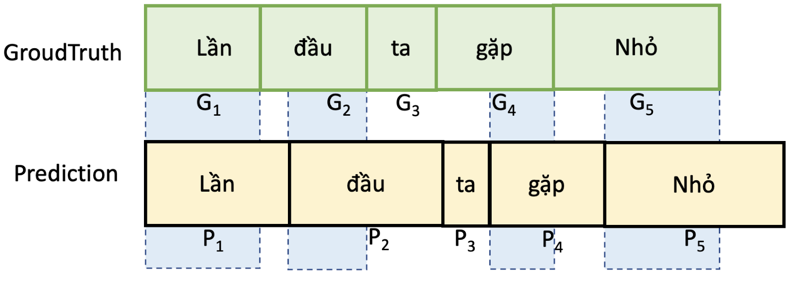
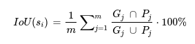

# Lyrics Alignment in ZALO AI 2022 Challenge 3 

#### -- Project Status: [Active]

## Overview
### Problem statement

Many of us love to sing along with songs in the way of our favorite singers in albums (karaoke style). To make it, we may need to remove the vocals of the singer(s) from the songs, then provide the lyrics aligned timely with the accompaniment sounds. There are various tools to remove vocals, but it is hard to align the lyrics with the song.

In this challenge, participants will build a model to align lyrics with a music audio.

* Input: a music segment (including vocal) and its lyrics.

* Output: start-time and end-time of each word in the lyrics.

## Evaluation
### Accuracy
Accuracy of prediction will be evaluated using Intersection over Union (IoU).
With IoU metric, the higher the better. The winner is the one achieving the highest IoU score.



IoU of prediction and the ground truth of an audio segment (𝑠𝑖) is computed by the following formula:



With IoU metric, the higher the better. The winner is the one achieving the highest IoU score.

## Datasets
Dataset is available [here]()

### Methods Used
* Source Code Representation (Abstract Syntax Tree, Control Flow Graph, Program Dependence Graph)
* Attention Mechanism
* Apriori Algorithm

## Requirements
### Code Preprocessing
* The GNU Compiler Collection (g++)
* [cppcheck](https://cppcheck.sourceforge.io)
* [tokenizer](https://github.com/dspinellis/tokenizer)
* [JOERN](https://joern.io)

### Models
* [Code2vec](https://code2vec.org)
* [Mocktail](https://github.com/NobleMathews/mocktail-blend) - reimplemented

## Usage
* The settings and model configuration parameters to our model are mentioned in [config.json](./main/config.json) 
* Using arguments:
    * ```--rawcreate``` : Create tags and raw dataset
    * ```--preprocess``` : Transform the raw source code into Code Property Graph
    * ```--split``` : Split the dataset into train/dev folds
    * ```--prepare_input``` : Preparing input for train process
    * ```--train``` : Training
    * ```--test``` : Testing
* For Example (Testing):
    Run the Script:
    ```
    python main.py --test
    ```
## Evaluation
* Target: 28 algorithm labels (after EDA)
* Code Label Result: 0.44 (F1 Score Micro)
## Dataset
* The complete Dataset is available [here]
## Weights
* The weight after trainning [here]
## Article [here](./article.docx)
## Contact
* Feel free to contact me through pvhung1302@gmail.com